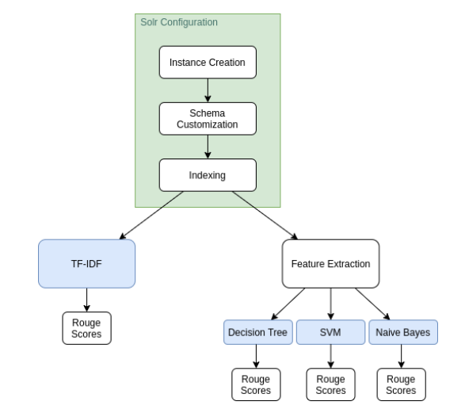
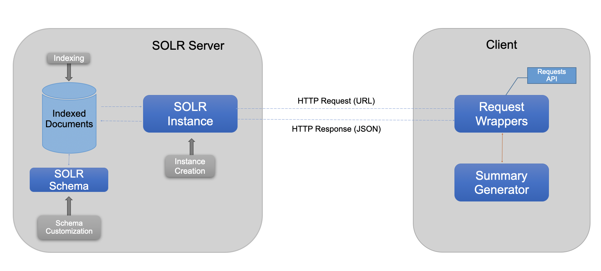

# Automatic Text Summarization - Extractive Techniques
The main goal of Automatic Text Summarization is the production of summaries from documents. Summaries are excerpts of the original text that
preserve key information content and overall meaning.

The goal of the following work is to analyze and implement different techniques of **Extractive Text Summarization**, and then compare their results. The main tasks of an Extractive Summarization process are:
1. Construction of an intermediate representation of the input text;
2. Scoring of the sentences based on such representation;
3. Selection of a summary comprising of a number of sentences (e.g. sentences with the highest score).

Methods that adopt TF-IDF representations and Machine Learning techniques were implemented. Furthermore, the work was contextualized in a typical Information Retrieval System, more specifically in an Apache Solr server. The following image shows the overall project steps:

Finally, the overall **system architecture** is:

More info can be found in the .pdf or the .pptx files, while the code can be found in the Jupyter Notebook files.

N.B.: this project was selected and presented as a seminar in the 2020/2021 course of Information Retrieval System at Università degli Studi di Napoli - Federico II.
